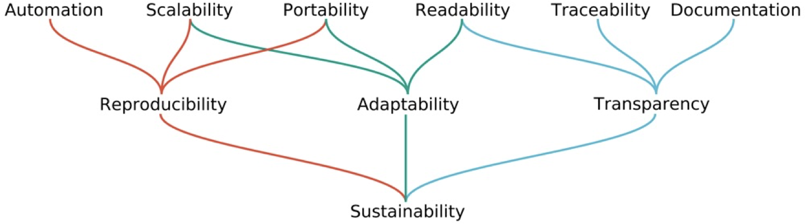

# Introduction

## Introduction

Data processing in bioinformatics involves the chaining of processes/threads/functions etc to process data. Commonly in bioinformatics we use Python (or another scripting language like a bash script) to create a pipeline in order to execute, then transform, then execute another program and so on. This chaining of programs allows a bioinformatician to start with one data type, say a FASTQ file and end up with a visualisation program to visualise the results of the analysis. To do this a number of programs which analyse and translate the data must be executed. Some of the processes are sequential, but some can be done paralel.

Data processing workflows in bioinformatics require a well designed pipeline. Bioinformatics research often needs high-performance computing resources to carry out data management and analysis tasks on large scale. Also the analysis needs to be carried out automatically especially in the case of multiple types of data sources, using multiple steps like mapping and filtering in the analysis process producing multiple types of results. Basically we would like to automate the process from raw data to final figures handling parallelisation, version control, suspend and resume, logging and data provenance.

<figure><figcaption>
Hierarchy of aspects to consider for sustainable data analysis: Mölder F, Jablonski KP, Letcher B et al. Sustainable data analysis with Snakemake [version 1]. F1000Research 2021, 10:33 (doi: 10.12688/f1000research.29032.1).
</figcaption></figure>

In this course you will learn to build professional work flow pipelines. We will work with a workflow engine called **snakemake** to build and execute pipelines in a professional and efficient manner. Snakemake is an MIT-licensed workflow management system that aims to structure complex data analysis. It can handle multiple scripts like shell, python and R and it supports parallelisation and logging. It can handle scheduling on any CPU, GPU or memory available and it can assess input or output files via HTTP, HTTPS, Amazon S3, Google Storage, Dropbox, FTP and SFTP.

Each week a case study is offered. You are asked to submit your solutions to a git repository so that your progress can be followed.
