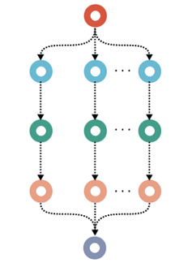

# DAG file

DAG is the abbreviation of directed acyclic graph (DAG) of jobs, representing the automatically derived execution plan from the example workflow. The job node colors reflect rule colors in the Graphical representation of the pipeline.&#x20;

<figure><figcaption><p>Source: Mölder F, Jablonski KP, Letcher B et al. Sustainable data analysis with Snakemake [version 1]. F1000Research 2021, 10:33 (doi: 10.12688/f1000research.29032.1)</p></figcaption></figure>

The workflow execution order can be viewed with the --dag command.&#x20;

```bash
snakemake --forceall --dag | dot -Tpng > dag.png
```

Mind you that if your snakefile pipeline script is named otherwise the commandline needs the --snakefile {name of snakefile} option.&#x20;
