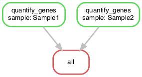

# Pipeline basics

## A simple snakefile

Consider the following pipeline script. The script takes the input files and processes the input files with a shell command to an output file.&#x20;

<figure><figcaption><p>DAG file for the script below</p></figcaption></figure>

```python
SAMPLES = ['Sample1', 'Sample2']

rule all:
    input:
        expand('results/{sample}.txt', sample = SAMPLES)

rule quantify_genes:
    input:
        genome = 'data/genome.fa',
        r1 = 'data/{sample}.R1.fastq.gz',
        r2 = 'data/{sample}.R2.fastq.gz'
    output:
        'results/{sample}.txt'
    shell:
        'echo {input.genome} {input.r1} {input.r2} > {output}'
```

### Understanding the Snakefile

The script is a general script that will run the rules for each sample. This can be done in paralel if we define enough cores. Let us analyse the script.&#x20;

The first line defines a list of strings called SAMPLES with our sample names that will be used later in the Snakefile.

```python
SAMPLES = ['Sample1', 'Sample2']
```

The code works with placeholders. `{sample}` in the example above can either hold `'Sample1'` or `'Sample2'`

```python
'results/{sample}.txt', sample = SAMPLES 
```

### Expand()

`expand()` is a special function that is automatically available to you in any Snakefile. It takes a string like `{sample}.txt` and expands it into a list like `['Sample1.txt','Sample2.txt']`

Rules in snakemake are like functions. The workflow is decomposed into rules defined by how to obtain output files from inputfiles. Execution order is determined based on input and output files. So dependencies determine the execution order. In our example script the

```python
rule all:
    input:
        expand('results/{sample}.txt', sample = SAMPLES)
```

needs as input 'Sample1.txt' and 'Sample2.txt. These files are not available. We only have available

* Sample1.R1.fastq.gz
* Sample1.R2.fastq.gz
* Sample2.R1.fastq.gz
* Sample2.R2.fastq.gz
* genome.fa

`rule quantify_genes` however generates the `Sample1.txt` and `Sample2.txt` files.

```python
    output:
        'results/{sample}.txt' # remember {sample}.txt = Sample1.txt and Sample2.txt
```

Instead of writing two rules (one rule for Sample1 and a second rule for Sample2) we write just one rule with the special string {sample}.txt as the output.

So the script needs to run `rule quantify_genes` first for `Sample1` and `Sample2` to generate the files `Sample1.txt` and `Sample2.txt`. Once they exists the `rule all` can be executed.

```python
rule quantify_genes:
    input:
        genome = 'data/genome.fa'
        r1 = 'data/{sample}.R1.fastq.gz',
        r2 = 'data/{sample}.R2.fastq.gz'
    output:
        'results/{sample}.txt'
    shell:
        'echo {input.genome} {input.r1} {input.r2} > {output}'
```

Looking at the code rule quantify\_genes: we see three parts

```
- input
- output
- shell
```

The input part defines variables genome, r1 and r2, each with assigned files to it. The output part defines the output file. The shell part defines how the output file is generated from the input file. In our fake pipeline, we won’t actually quantify gene expression. Instead, we’ll just echo the names of the input files into an output file. The line

```mathml
echo {input.genome} {input.r1} {input.r2} > {output} 
```

can be translated in the case of Sample1 to the shell command

```python
echo genome.fa data/Sample1.R1.fastq.gz data/Sample1.R2.fastq.gz> Sample1.txt
```

### Running the pipeline

We can run the pipeline by invoking snakemake. It knows to look for a file called Snakefile. Otherwise, you can specify a file to use with the --snakefile option.

```python
snakemake --snakefile Snakefile
```

```python
Building DAG of jobs...
Using shell: /bin/bash
Provided cores: 8
Rules claiming more threads will be scaled down.
Job stats:
job               count    min threads    max threads
--------------  -------  -------------  -------------
all                   1              1              1
quantify_genes        2              1              1
total                 3              1              1

Select jobs to execute...

[Thu Jan  6 10:34:29 2022]
rule quantify_genes:
    input: data/genome.fa, data/Sample2.R1.fastq.gz, data/Sample2.R2.fastq.gz
    output: results/Sample2.txt
    jobid: 2
    wildcards: sample=Sample2
    resources: tmpdir=/var/folders/xq/_9ngln8x7sj5m9whf10z9wzw0000gn/T


[Thu Jan  6 10:34:29 2022]
rule quantify_genes:
    input: data/genome.fa, data/Sample1.R1.fastq.gz, data/Sample1.R2.fastq.gz
    output: results/Sample1.txt
    jobid: 1
    wildcards: sample=Sample1
    resources: tmpdir=/var/folders/xq/_9ngln8x7sj5m9whf10z9wzw0000gn/T

[Thu Jan  6 10:34:29 2022]
Finished job 2.
1 of 3 steps (33%) done
[Thu Jan  6 10:34:29 2022]
Finished job 1.
2 of 3 steps (67%) done
Select jobs to execute...

[Thu Jan  6 10:34:29 2022]
localrule all:
    input: results/Sample1.txt, results/Sample2.txt
    jobid: 0
    resources: tmpdir=/var/folders/xq/_9ngln8x7sj5m9whf10z9wzw0000gn/T

[Thu Jan  6 10:34:29 2022]
Finished job 0.
3 of 3 steps (100%) done

```

As you can see first the rule quantify\_genes is executed for Sample2, then quantify\_genes is executed for Sample1 and then rule all is executed. Mind you that the samples are processed in random order!

Here are the output files that were created:

```bash
head Sample?.txt
```

```bash
==> Sample1.txt <==
data/genome.fa data/Sample1.R1.fastq.gz data/Sample1.R2.fastq.gz

==> Sample2.txt <==
data/genome.fa data/Sample2.R1.fastq.gz data/Sample2.R2.fastq.gz
```
