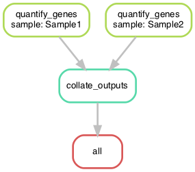

# Adding another rule

Below you find an example of another rule. In this case a python script is used for the processing step and not a shell command.

<figure><figcaption><p>add the rule collate_outputs</p></figcaption></figure>

The rule `quantify_genes` produces the files Sample1.txt and Sample2.txt, de rule `collate_outputs` produces the file test.txt

```python
SAMPLES = ['Sample1', 'Sample2']

rule all:
    input:
        'results/collated.txt'

rule quantify_genes:
    input:
        genome = 'data/genome.fa',
        r1 = 'data/{sample}.R1.fastq.gz',
        r2 = 'data/{sample}.R2.fastq.gz'
    output:
        'quantified/{sample}.txt'
    shell:
        'echo {input.genome} {input.r1} {input.r2} > {output}'

rule collate_outputs:
    input:
        expand('quantified/{sample}.txt', sample=SAMPLES)
    output:
        'results/collated.txt'
    run:
        with open(output[0], 'w') as out:
            for i in input:
                sample = i.split('.')[0]
                for line in open(i):
                    out.write(sample + ' ' + line)
```

The `collated.txt` in the results directory now contains the following:

```bash
quantified/Sample1 data/genome.fa data/Sample1.R1.fastq.gz data/Sample1.R2.fastq.gz
quantified/Sample2 data/genome.fa data/Sample2.R1.fastq.gz data/Sample2.R2.fastq.gz
```
