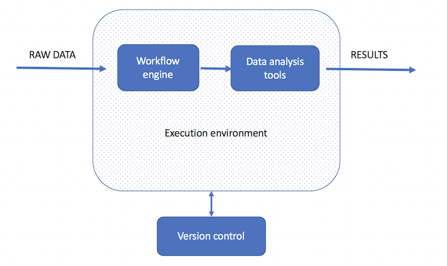

# Pipeline components

To build a professional and efficient pipeline we need several components. We need an execution environment such as`conda`, we need data, tools to process and analyse the data (self build python or R scripts or tools like bowtie), a version control system like `git` or and a workflow / pipeline script that calls all the other scripts and tools. In the bioinformatics dataprocessing course we will use the following components as a base:

<figure><figcaption><p>Elements of a data analysis workflow</p></figcaption></figure>

* workflow engine: `snakemake`
* execution environment: `conda`
* version control: git / bitbucket (whatever you prefer)
* data processing and analysis scripts: python / R

## repository

It is recommended to store each workflow in a dedicated git repository of the following structure:

```
├── .gitignore
├── README.md
├── LICENSE.md
├── images
│   ├── dag.png
├── workflow
│   ├── rules
|   │   ├── module1.smk
|   │   └── module2.smk
│   ├── scripts
|   │   ├── script1.py
|   │   └── script2.R
|   └── main.smk
├── config
│   ├── config.yaml
├── results
└── resources
```

See [https://github.com/rwedema/BFVH4DSP1](https://github.com/fenna/BFVH4DSP1) for an example

In other words, the workflow code goes into a subfolder `workflow`, while the configuration is stored in a subfolder `config`. Inside of the `workflow` subfolder, the central `Snakefile` marks the entrypoint of the workflow (it will be automatically discovered when running snakemake from the root of above structure. In addition to the central `Snakefile`, rules can be stored in a modular way, using the optional subfolder `workflow/rules`. Such modules should end with `.smk` the recommended file extension of Snakemake. Further, [scripts](https://snakemake.readthedocs.io/en/stable/snakefiles/rules.html#snakefiles-external-scripts) should be stored in a subfolder `workflow/scripts`
