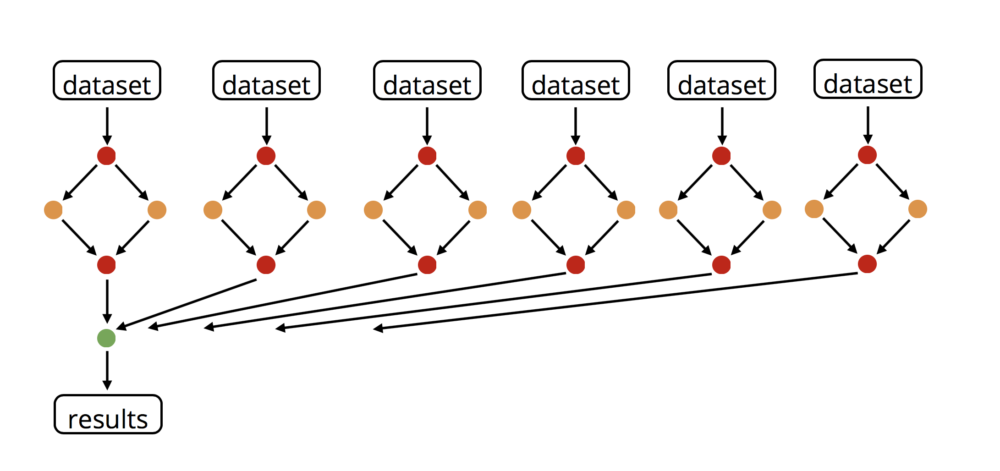
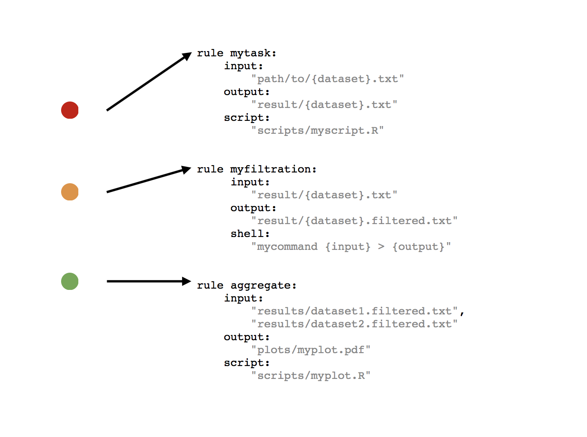

# Theory of SnakeMake

A SnakeMake worflow defines a data analysis in terms of rules that are specific in the execution script (a SnakeFile)

<figure><figcaption><p>data analysis: source Johannes Koester 2018</p></figcaption></figure>

<figure><figcaption><p>data analysis in terms of rules: source Johannes Koester 2018</p></figcaption></figure>

### rules

A rule consist of a name, input files, output files and a part to generate the output from the input. Most of the time this is a shell command, but this can be a call to an external script or a python code as well.&#x20;

```python
rule myfiltration: #name = myfiltration
    input: 
        "result/{dataset}.txt" #input file
    output:
        "result/{dataset}.filtered.txt" #output file
    shell: 
        "mycommand {input} > {output}" #part to generate output from input
```

### order of rules

For a given target, a rule that can be applied to create it is determined (a job). For the input files of the rule, go on recursively. If no target is specified, Snakemake tries to apply the first rule in the workflow.&#x20;

Before running the script Snakemake scans which rules needs to be executed and in which order. This process is top-down. It starts with the first rule and searches for the input file (the final target file). If this one does not exists it searches for the rule that generate that file. If from that rule the required input file does not exist it searches for the rule where the required input files are generated and so on.

### wildcards {}

The rules can handle several samples by generalising the dataset parameter using wildcards . The wildcard is defined by the brackets {} like this `{dataset}`

### input index versus variable names

Snakemake can handle multiple input files addressing them by index or by name

```python
#by index
rule sort_and_annotate:
    input:
        a = "path/{dataset}.txt"
        b = "path/annotation.txt"
    output:
        "{dataset}.sorted.txt"
    shell:
        "paste <(sort {input[0]}) {input[1]} > {output}"
    
```

```python
#by name
rule sort_and_annotate:
    input:
        a = "path/{dataset}.txt"
        b = "path/annotation.txt"
    output:
        "{dataset}.sorted.txt"
    shell:
        "paste <(sort {input.a}) {input.b} > {output}"
```

### python code in snakemake

Snakemake can handle arbitrary python code

```python
SAMPLES = ['Sample1', 'Sample2']

rule all:
    input:
        expand('{sample}.txt', sample = SAMPLES) #use python code to expand

rule quantify_genes:
    input:
        genome = 'genome.fa',
        r1 = 'data/{sample}.R1.fastq.gz',
        r2 = 'data/{sample}.R2.fastq.gz'
    output:
        '{sample}.txt'
    shell:
        'echo {input.genome} {input.r1} {input.r2} > {output}'
```

### execution of rules

The execution of a rule is a `job`. Snakemake execute a rules only if

* the output file is a target and does not exist
* the output file is needed by another executed job and does not exist
* the input file is newer than output file
* the input file will be updated by other job
* execution is enforced

### run pipeline

the workflow can be run with a command line interface.&#x20;

```bash
#execute the workflow with target D1.sorted.txt
snakemake D1.sorted.txt

#exececute the workflow without target. First rule defines target
snakemake

#dry-run
snakemake -n

#dry-run, print shell commands
snakemake -n -p

#snakemake dry-run, print execution reason for job
snakemake -n -r

#clean all the output
snakemake --delete-all-output 
```

see also


