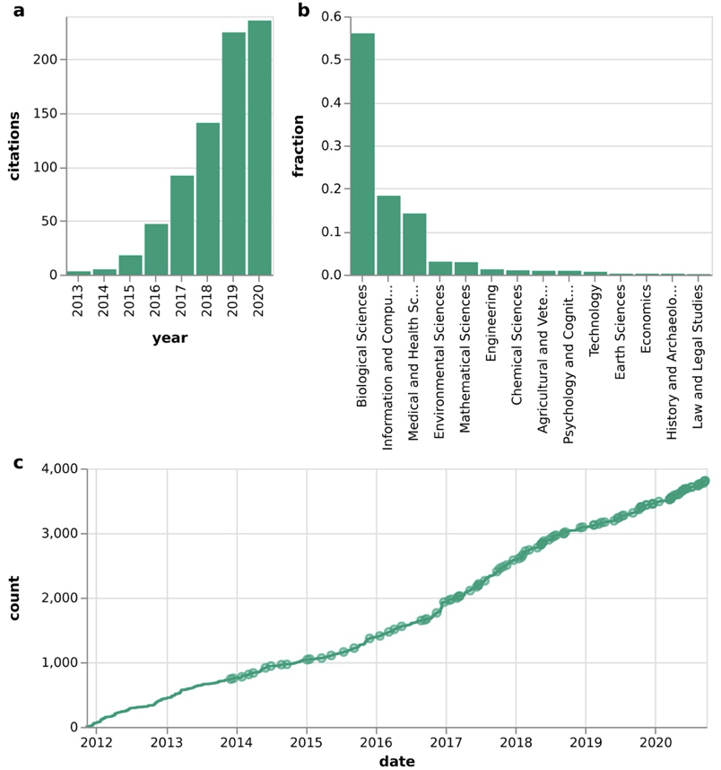
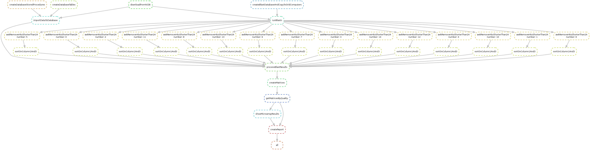

# Why use SnakeMake

Nowadays snakemake is used more and more for bioinformatics pipelines.

<figure><figcaption>
Mölder F, Jablonski KP, Letcher B et al. Sustainable data analysis with Snakemake [version 1]. F1000Research 2021, 10:33 (doi: 10.12688/f1000research.29032.1)
</figcaption></figure>

We will work with snakemake because it has several advantages comparing with a bash script

* it is based on Python
* open source
* designed with bioinformatics in mind
* easy to offload processes to cluster nodes
* can handle multiple input and output files
* many bonus features: configuration, graphs of workflows, logreports
* only executes parts that are not processed before

## Why parallelization matters

<figure><figcaption>
Running jobs in parallel can reduce time enormously 
</figcaption></figure>
