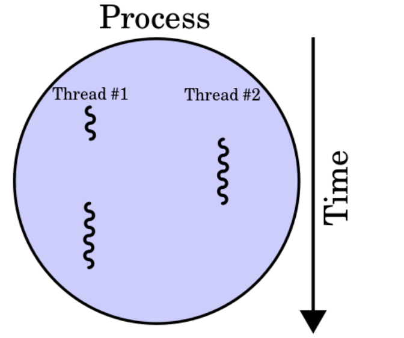

# CPU

The circuitry in a computer that performs operations on data is not directly connected to storage cells in the main memory. Instead, this circuitry is isolated in a part of the computer called the **central processing unit**, or **CPU**. The part consists of two parts: **arithmetic/logic**, which contains circuitry that performs data manipulation, and the **control unit** which contains circuitry for coordinating the machine’s activity.


<figure><figcaption><p>Original downloaded from Wikipedia</p></figcaption></figure>

The fundamental operation of most CPUs is to execute **a sequence of stored instructions that is called a program**. The instructions to be executed are kept in some kind of computer memory. Nearly all CPUs follow the fetch, decode, and execute steps in their operation, which are collectively known as the instruction cycle.

The more instructions, the more data manipulations, the more time. To reduce time we can use more processing units and run steps in parallel. Let’s investigate possibilities…

To get an of idea what is available on a machine you can type

```bash
lscpu | egrep 'Thread|Core|Socket|^CPU\('
```

Each machine has one or more CPU’s. We can request this information by the following command:

```bash
fennaf@idefix:~$ lscpu | egrep 'Thread|Core|Socket|^CPU\('
CPU(s):                24
Thread(s) per core:    2
Core(s) per socket:    6
Socket(s):             2
```

In this machine, we have two sockets. Two physical processors (chips) are added to the motherboard. A chip can have one or more cores, which in effect separates the CPUs. Thus a single processor, a six-core box, effectively has 6 CPUs inside. Some CPUs can use hyper-threading and can run more than one thread on each core. In this case, we have 2 Threads per core. So the six-core box effectively has 12 CPUs inside. 2 Sockets make `2 * 2 * 6 = 24` effective CPUs.

<figure><figcaption></figcaption></figure>

## Threads

Some CPUs can use hyperthreading or multithreading and run more than one thread on each core.

<figure><figcaption><p>Image downloaded from Wikipedia</p></figcaption></figure>

For some tools within the pipelines, it is advisable to use more than one thread to speed up the computation. (Or even use more threads divided over more CPU’s).
